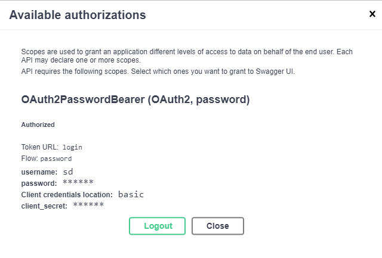
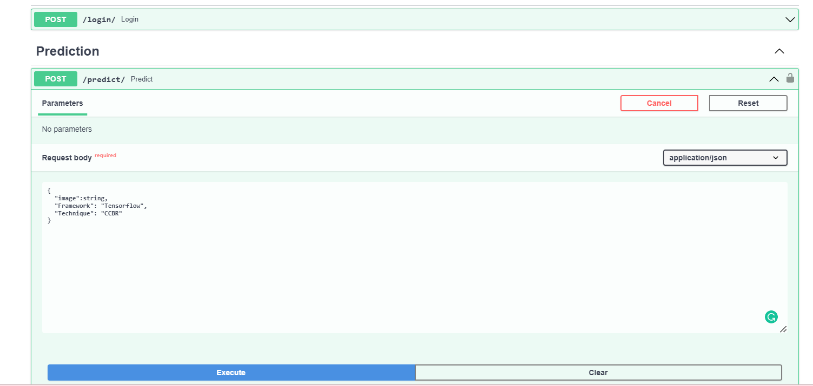

**Deep Image Search** is an AI-based image search engine that includes **CCBR(CNN Classifier Based Retrieval technique)** with **vectorized search technique** or **deep transfer learning features Extraction** with **vectorized search technique**


          


<h2> Creators </h2>

### [Mohan Kumar](https://github.com/kkkumar2?tab=repositories)

### Sandeep Jena

# About the Project:
    
This project can be applied to recommend images based on the image you upload. The technique used here are
    
    1) CCBR - This technique is a custom trained model which classifies the incoming image and extracts the features    parallely and recommends top 5 images by using KNN. This technique is handled in both Tensorflow and Pytorch frameworks

    2)Normal feature Extraction using pretrained model - This technique uses VGG16 in Tensorflow and RESNET50 model in Pytorch framework. This Method will not classify image into category and use that category for selecting top 5 images instead we search the Entire images in all category using sklearn library algorithm (KNN) (There Is Not Required C++ build tool)
    Speed and accuracy as comparisons to ANNOY Library is less.
    
    
        
#### If you want to used ANNOY Library insted of sklearn libary There is another [repro](https://github.com/kkkumar2/Image_Recommendation_System)
### **KNN K-NearestNeighbors oh yeah:**
**input** - Create a index with the help of all images and use that index while predicting


**Build CCBR Pytorch Feature Extractor**
```Python
img = Image.open(img).convert("RGB") 
img = self.Transform(img)
if len(img.shape) == 3:
    img = img[None]

feature = self.modelfeaturevecotr(img)[0] 
return feature/norm(feature)
```
**Store The Data**
```Python
dataset = LoadImagesCCBR(self.imagedir)
features = {keys:[] for keys in dataset.uniquecategory}
filenames = {keys:[] for keys in dataset.uniquecategory}

for category,path in tqdm(dataset,ncols = 100,colour='YELLOW'):
    try:
        feat = self.extract(path).numpy()
        features[category].append(feat)
        filenames[category].append(path)
    except :
        features[category].append(None)
        filenames[category].append(path)
        continue

util.dump_pickle(self.metadatapytrochccbrfeatures,features)
util.dump_pickle(self.metadatapytorchimagenamesfilename,filenames)

```
**Predict**
```python
index = self.PredictClass(img)
featurevector = self.FE.extract(img).numpy()
neighbors = NearestNeighbors(n_neighbors=6, algorithm='brute', metric='euclidean')
neighbors.fit(self.dictcatvector[self.classes[index]])

distances, indices = neighbors.kneighbors([featurevector])
files = [] 
for ind in indices[0]:
    file = self.dictcatfilename[self.classes[index]][ind]
    files.append(file)

return files[1:]


```


How to use this Project in your local:

Clone the Repository using
```bash
git clone https://github.com/sandeepjena7/Image-Based-Recommendation-System.git
```
Create a environment and install all the requirements from requirements.txt
```bash
conda env create -f environment.yml
```
**OR**

```bash
bash initial_setup.sh
```
Activate enviroment
```bash
source activate recomendation
```

Run the following command to run the web application locally
```bash
streamlit run Streamlit.py
```
A demo is  shown below:


Run the following command to run the API
```bash
uvicorn app:app --reload
```
**OR** 
```python
python app.py
```
**Authorizations of username and password**
```bash
username - sd OR mk
password - password
```
A demo is  shown below:



## Dataset
<a href="https://drive.google.com/drive/folders/1iReMDMw_WSyuLTXXWQv7H0jMv2e4Wsqd?usp=sharing">Click here</a> to get the dataset of resized 5000 images from myntra
## Special Thanks
#### Rishave Dash @ineuron
